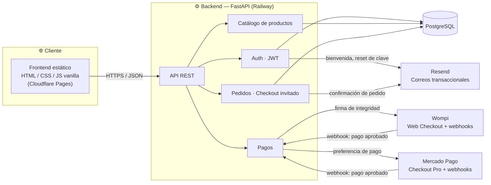

<div align="center">

# 🌹 JG Parfums

**Tienda de perfumes de nicho construida con FastAPI, PostgreSQL y JavaScript vanilla**

Autenticación · Catálogo · Categorías · Decants (5ml/10ml) · Carrito · Checkout (registrado e invitado) · Pagos (Wompi + Mercado Pago) · Panel administrativo con tienda en vivo editable

### 🔗 [jg-parfums.pages.dev](https://jg-parfums.pages.dev) — frontend y backend en línea, en construcción

[](https://www.python.org/)
[](https://fastapi.tiangolo.com/)
[](https://www.postgresql.org/)
[](https://www.sqlalchemy.org/)
[](https://alembic.sqlalchemy.org/)
[](#)
[](https://railway.app/)
[](https://jg-parfums.pages.dev)
[](#-estado-actual)

</div>

---

## 📌 Tabla de contenidos

- [Sobre el proyecto](#-sobre-el-proyecto)
- [Estado actual](#-estado-actual)
- [Qué falta antes de lanzar](#-qué-falta-antes-de-lanzar)
- [Arquitectura](#-arquitectura)
- [Características](#-características)
- [Novedades recientes](#-novedades-recientes)
- [Stack técnico](#-stack-técnico)
- [Estructura del proyecto](#-estructura-del-proyecto)
- [Instalación rápida](#-instalación-rápida)
- [Cómo correr los tests](#-cómo-correr-los-tests)
- [Variables de entorno](#-variables-de-entorno)
- [Despliegue](#-despliegue)

---

## Sobre el proyecto

**JG Parfums** es una tienda online de perfumes originales de nicho para el mercado colombiano. El sitio se construyó siguiendo un manual de marca real (`BRAND.md`) — paleta Ónix/Oro/Marfil, tipografía Newsreader + Jost, reglas explícitas de uso del dorado — en vez de un estilo genérico de e-commerce.

El backend expone una API REST con **FastAPI** sobre **PostgreSQL** (SQLAlchemy 2.x, patrón síncrono), y el frontend es **HTML, CSS y JavaScript vanilla**, sin frameworks ni paso de build.

## Estado actual

**El sitio todavía no está vendiendo.** El pipeline técnico completo (frontend, backend, base de datos, correos, pagos) ya está en línea, probado de punta a punta y con credenciales reales de producción. Lo que falta es contenido real del cliente.

| Módulo | Estado |
|---|---|
| Backend (auth, catálogo, categorías, decants, notas, pedidos, pagos, ajustes, admin) | ✅ Construido y probado (65 tests, SQLite en CI / Postgres real en producción) |
| Backend desplegado (Railway) | ✅ En línea — `jg-parfums-production.up.railway.app` |
| Migraciones aplicadas en la base de datos de producción | ✅ Aplicadas en Railway |
| Decants (5ml/10ml por producto, precio y stock propios) | ✅ Backend, panel admin y ficha de producto construidos y probados |
| Notas de producto libres (nombre + color por nota, escalera con la más fuerte abajo) | ✅ Backend, panel admin y ficha de producto/hero construidos y probados |
| Categorías y estadísticas propias de tráfico (sin cookies ni datos personales) | ✅ Backend, panel admin y filtro de catálogo construidos y probados |
| Panel admin: tienda en vivo editable (secciones de página: banner, anuncio, testimonios, contadores, etc.) y Ajustes de marca (nombre, color, tipografía, contacto/redes, envío) | ✅ Construido y probado |
| Secciones fijas de cada página (hero, encabezados, bloque de decants, manifiesto) editables desde el panel, con historial de versiones y restauración | ✅ Backend, panel admin y sitio público construidos y probados |
| Frontend (tienda, cuenta, panel admin) | ✅ Construido — sistema de diseño documentado (`DESIGN.md`), tipografía de títulos Newsreader (legible en cualquier densidad de pantalla), acentos circulares para romper la retícula sin tocar el radio duro de botones/tarjetas |
| Frontend desplegado (Cloudflare Pages) | ✅ En línea — [jg-parfums.pages.dev](https://jg-parfums.pages.dev) |
| CORS frontend ↔ backend | ✅ Verificado con petición real |
| Correos transaccionales (Resend) | ✅ Confirmado de punta a punta (registro → correo de bienvenida recibido) |
| Pago con Wompi | ✅ Credenciales de producción configuradas — flujo de pago completo probado |
| Pago con Mercado Pago | ✅ Credenciales de producción configuradas — flujo de pago completo probado |
| Catálogo con productos reales | ⏳ Productos de prueba cargados — falta contenido y fotografía real del cliente |
| Política de tratamiento de datos / términos | ❌ Pendiente (obligatorio en Colombia, Ley 1581 de 2012) |
| Dominio propio | ❌ Pendiente — usando `*.pages.dev` / `*.up.railway.app` por ahora |

## Qué falta antes de lanzar

**Bloqueante para vender:**
- [ ] Catálogo real: nombre, casa, notas, precio, stock y fotografía de cada perfume (hoy tiene productos de prueba, sin fotos)
- [ ] Página de política de tratamiento de datos personales y términos de compra
- [ ] Verificar un dominio propio en Resend (hoy los correos salen desde `onboarding@resend.dev`, su dirección de pruebas, que solo entrega a la cuenta dueña de la API key — no a clientes reales)

**No bloqueante, pero pendiente:**
- [ ] Borrar la cuenta admin y los productos de prueba antes de lanzar
- [ ] Confirmar tono "tú/usted" del copy (hoy en "tú" por defecto)
- [ ] Cargar el costo de envío real en Ajustes (el campo ya existe y el checkout ya lo suma; hoy está en 0 por defecto)
- [ ] Dominio propio (ej. `jgparfums.com`) en vez de los subdominios de Railway/Cloudflare

## Arquitectura



## Características

<table>
<tr>
<td valign="top" width="50%">

### Frontend

- Home: producto destacado como ficha técnica interactiva, con sus notas olfativas reales en una escalera de barras (más fuerte abajo), grilla de recién llegados, bloque de decants
- Catálogo con filtros (categoría, rango de precio, búsqueda, orden por precio, solo con decant disponible)
- Ficha de producto: galería, notas olfativas en escalera, selector de presentación (frasco completo o decant de 5ml/10ml), stock por presentación
- Carrito persistido en el navegador (`localStorage`), con una línea independiente por presentación
- Checkout con datos de envío, costo de envío configurable y elección de pasarela de pago
- Cuentas de usuario opcionales + checkout invitado
- Historial de pedidos para usuarios registrados
- Footer con iconos de métodos de pago y, si el admin los configura en Ajustes, iconos de WhatsApp/Instagram/TikTok que enlazan directo a esas cuentas
- Panel administrativo (SPA de 3 columnas): editor de "tienda en vivo" (secciones de página administrables — banner, anuncio, testimonios, contadores, categorías, footer — con vista previa en vivo por dispositivo), productos (notas, decants, desactivar/eliminar), pedidos, categorías, métricas propias y ajustes de marca (nombre, color de acento, tipografía, contacto/redes, envío)
- Las secciones fijas de cada página (hero, "Recién llegados", bloque de decants, manifiesto de marca, encabezados) también son editables/ocultables/eliminables desde el mismo panel, con historial de versiones y restauración de un clic

</td>
<td valign="top" width="50%">

### Backend

- API REST con FastAPI y autenticación JWT
- Registro/login/recuperación de contraseña sin enumeración de cuentas
- Gestión de productos, imágenes y notas olfativas (nombre + color libres por nota, ordenables)
- Categorías de producto, con filtro en catálogo
- Secciones de página administrables desde el panel (`page_sections`), tanto agregadas libremente como las partes fijas originales de cada página (hero, encabezados, decants, manifiesto) — mismo mecanismo para las dos
- Historial de versiones (`page_section_history`): cada creación/edición/borrado queda guardado con una copia completa del contenido y se puede restaurar, incluso si la sección ya fue borrada
- Ajustes de marca en una fila única (`site_settings`): color de acento (regenera toda la escala dorada), tipografía, datos de contacto/redes y costo de envío
- Estadísticas propias de tráfico (sin cookies, IP ni user-agent) para el panel de Métricas
- Decants por producto (5ml/10ml): precio y stock propios, independientes del frasco completo
- Pedidos con descuento de stock transaccional (respeta la presentación comprada: frasco completo o decant) y costo de envío configurable
- Borrado de producto en dos niveles: desactivar (oculta de la tienda, reversible) o eliminar permanentemente (hard delete; los pedidos ya guardan su propio snapshot de nombre/precio, así que no se pierde el historial)
- Integración con Wompi (firma de integridad + verificación de checksum de webhook)
- Integración con Mercado Pago (preferencias + verificación HMAC de webhook)
- Envío de correos transaccionales centralizado (Resend)
- Rate limiting en endpoints sensibles (login, registro, checkout)
- Suite de tests (65) contra SQLite en memoria, sin tocar servicios externos

</td>
</tr>
</table>

## Novedades recientes

> Changelog de la construcción inicial del proyecto.

- Secciones fijas de cada página (hero de home, "Recién llegados", bloque de decants, manifiesto de marca, encabezado de catálogo, "También te puede interesar" en ficha de producto) convertidas en editables desde el panel — antes eran HTML fijo, ahora se pueden editar, ocultar o eliminar sin tocar código, igual que las secciones agregadas libremente. Se suma un historial de versiones (`page_section_history`): cada cambio queda guardado con una copia completa del contenido y se puede restaurar con un clic, incluso si la sección ya fue borrada — se conecta al botón "Historial" del panel, que ya existía en la interfaz pero estaba deshabilitado. Encontrado y corregido en el camino un bug real: cuando una página no tenía secciones agregadas libremente, los botones de las secciones fijas quedaban sin funcionar (el código cortaba antes de conectar los clics). 5 tests nuevos.
- Título de la tienda de Bodoni Moda a Newsreader: verificado en producción que un didone de contraste tan alto como Bodoni Moda perdía legibilidad contra fondos claros en monitores de escritorio de densidad estándar, incluso en tamaños grandes — el problema no era el tamaño, era el diseño de la tipografía. Se reemplaza por Newsreader (serif editorial de contraste moderado) en todo el sitio vía la variable `--font-display`, y se corrige el nombre de producto en tarjeta (que ya debía ir en Jost según `DESIGN.md` pero estaba implementado en Bodoni a 16px, muy por debajo del piso de legibilidad).
- Botón "Eliminar" de producto: corregido para que borre de verdad (antes solo desactivaba) — `DELETE /products/{id}?hard=true`, seguro porque `order_items` guarda su propio snapshot de nombre/precio y no depende de la fila del producto. Se separó del botón "Desactivar" existente y se agregó manejo de errores visible (antes una falla quedaba completamente silenciosa).
- Footer con iconos de métodos de pago (Visa, Mastercard, Nequi, PSE, Bancolombia, Mercado Pago) e iconos circulares de WhatsApp/Instagram/TikTok que solo aparecen si el admin configuró esa red en Ajustes — corregido un bug real donde los iconos de pago quedaban casi invisibles: un SVG cargado con `` no hereda `currentColor` de la página, así que caían a negro por defecto sobre el fondo oscuro del footer.
- Pase de formas para romper la retícula del home sin tocar el radio duro de botones/tarjetas/campos (regla de marca explícita en `DESIGN.md`): corte diagonal en la esquina del diagrama de notas del hero, numerales en anillo dorado en la tira de manifiesto, punto hueco al final del filete de cada título de sección.
- Notas de producto rediseñadas: de 3 campos fijos de texto (salida/corazón/fondo) a una lista libre de notas individuales, cada una con nombre y color elegidos por el admin, mostrada como una escalera con el tono más fuerte abajo. Tabla `product_notes` nueva, migración con backfill de los datos existentes, 6 tests nuevos.
- Panel admin rediseñado por completo como editor de "tienda en vivo": shell de 3 columnas (secciones a la izquierda, vista previa en vivo con selector de dispositivo al centro, productos/pedidos a la derecha), sistema de `page_sections` (11 tipos: banner, anuncio, testimonios, contadores, etc.) para editar partes de la página sin tocar código, y una pestaña de Ajustes que reconfigura nombre de tienda, color de marca (regenerando toda la escala dorada), tipografía (5 combinaciones curadas), contacto/redes y costo de envío.
- Categorías de producto y estadísticas propias de tráfico (sin cookies, IP ni user-agent), con sus propias pestañas en el panel admin y filtro de categoría en el catálogo.
- Credenciales de producción de Wompi y Mercado Pago configuradas en Railway; flujo de pago completo (checkout → webhook → pedido pagado → correo de confirmación) probado de punta a punta con ambas pasarelas.
- Feature de decants: tabla `product_variants` (precio y stock propios por presentación de 5ml/10ml, independiente del frasco completo), endpoints de admin para gestionarlos, y lógica de checkout que descuenta el stock correcto según la presentación comprada. 6 tests nuevos.
- Sistema de diseño documentado en `DESIGN.md` (formato estándar, con `.impeccable/design.json` como sidecar de tokens) a partir de la identidad ya implementada en `BRAND.md` — nombrado "El cuaderno del perfumista", con sus componentes de firma (`spec-row`, `scent-diagram`, `ledger-row`) consolidados como vocabulario compartido.
- Home rediseñada: el producto destacado se muestra como una ficha técnica interactiva (nombre, pirámide olfativa tocable con las notas reales de salida/corazón/fondo), en vez de un hero genérico con eslogan.
- Catálogo con filtros nuevos (rango de precio, solo productos con decant disponible) y precio "Desde $X" en las tarjetas cuando el perfume tiene decants — el orden por precio usa ese mismo valor.
- Ficha de producto con selector de presentación (frasco completo / decant 5ml / decant 10ml), cada una con su propio precio y aviso de stock.
- Backend completo construido desde cero: modelos, rutas, servicios de pago y auth, siguiendo el esqueleto de `ARQUITECTURA_BASE.md`.
- 23 tests automatizados (pytest + SQLite en memoria) cubriendo auth, productos, pedidos y pagos.
- Migración inicial de Alembic generada, probada con un ciclo completo `upgrade → downgrade → upgrade` contra Postgres real en Docker — se encontró y corrigió un bug real: los tipos ENUM nativos de Postgres no se borraban en el downgrade, lo que rompía un re-upgrade.
- Corrección de un bug de enrutamiento: los webhooks `/payments/wompi/webhook` y `/payments/mercadopago/webhook` quedaban tapados por las rutas dinámicas `/payments/wompi/{order_number}` — Starlette resuelve rutas en orden de registro.
- Frontend completo (13 páginas) construido siguiendo `BRAND.md` al pixel: tokens de color, tipografía, espaciado y componentes exactos del manual de marca.
- Mockup visual del sitio (home, catálogo, ficha de producto — móvil y escritorio) revisado contra `BRAND.md` y corregido: estrella del hero con núcleo equivocado para fondo oscuro, subtítulos en la tipografía de display por debajo del tamaño mínimo permitido, contraste insuficiente en el contador del carrito, y un espaciado fuera de la escala de 4px.
- Base de datos de producción migrada en Railway (7 tablas), verificada contra la base real antes y después de aplicar el esquema.
- Repositorio transferido de la cuenta personal del desarrollador a la cuenta de GitHub del cliente (`jgparfumscol-dev`).
- Frontend desplegado en Cloudflare Pages.
- Backend desplegado en Railway. Tres problemas reales de build encontrados y corregidos en el camino:
  - El *root directory* del servicio no apuntaba a `backend/`, así que Railway intentaba construir desde la raíz del repo y no encontraba nada reconocible.
  - `mise` (usado por Railpack para instalar Python) fallaba instalando `python@3.12.3` por no encontrar "GitHub artifact attestations" de ese build — se agregó `backend/mise.toml` desactivando esa verificación puntual (el checksum del binario sí se sigue verificando).
  - El puerto público del dominio generado apuntaba a `5432` (el de Postgres, no el de la app) — corregido al puerto real que Railway inyecta.
- CORS bloqueaba el origen real del frontend (`Disallowed CORS origin`) hasta confirmar que Railway no redespliega solo al editar variables — hubo que redesplegar manualmente para que tomara el `FRONTEND_URL` correcto.
- Integración de Resend verificada con un envío real: cuenta admin creada, 4 productos de prueba cargados vía API, y un registro de usuario real confirmó la entrega del correo de bienvenida en la bandeja del cliente.

## Stack técnico

| Categoría | Tecnología |
|---|---|
| **Lenguaje** | Python 3.12 |
| **Framework backend** | FastAPI + Uvicorn |
| **ORM / Base de datos** | SQLAlchemy 2.x (síncrono) + PostgreSQL |
| **Migraciones** | Alembic |
| **Auth** | JWT (python-jose) + bcrypt |
| **Frontend** | HTML5, CSS3, JavaScript vanilla — sin build step |
| **Pagos** | Wompi + Mercado Pago |
| **Email transaccional** | Resend |
| **Rate limiting** | slowapi (por IP, en endpoints de auth y checkout) |
| **Infraestructura** | Railway (backend) · Cloudflare Pages (frontend) |

## 📁 Estructura del proyecto

```
.
├── backend/
│   ├── routes/          # auth, products, categories, orders, payments, settings, stats, page_sections
│   ├── models/           # Modelos SQLAlchemy (incluye product_note, product_variant, site_settings, page_section, page_section_history)
│   ├── schemas/           # Esquemas Pydantic
│   ├── services/           # Wompi, Mercado Pago, email
│   ├── middleware/           # Auth (JWT) y dependencias de rol
│   ├── alembic/                # Migraciones de base de datos
│   └── tests/                   # pytest, SQLite en memoria (65 tests)
├── frontend/          # Páginas HTML, css/ y js/ compartidos, assets/payment (iconos del footer)
├── Logos/             # Assets de marca originales (manual de marca en PDF)
├── BRAND.md           # Manual de marca — fuente de verdad de diseño
└── DESIGN.md          # Sistema de diseño documentado (tokens, componentes, reglas) a partir de BRAND.md
```

## Instalación rápida

```bash
# 1. Backend
cd backend
python -m venv venv
source venv/bin/activate      # En Windows: venv\Scripts\activate
pip install -r requirements.txt
cp .env.example .env           # completar con credenciales reales
alembic upgrade head
uvicorn main:app --reload

# 2. Frontend
# Servir frontend/ con cualquier servidor estático local, ej.:
cd frontend && python -m http.server 8000
```

## Cómo correr los tests

La suite de pytest corre contra una base de datos SQLite en memoria y nunca toca `DATABASE_URL` real ni servicios externos (Wompi, Mercado Pago y Resend quedan mockeados o deshabilitados en el entorno de test).

```bash
cd backend
pip install -r requirements-dev.txt

pytest                     # correr toda la suite
pytest --cov=.             # con reporte de cobertura (usa backend/.coveragerc)
pytest tests/test_payments.py -v   # un archivo puntual
```

## Variables de entorno

| Variable | Propósito |
|---|---|
| `DATABASE_URL` | Cadena de conexión a PostgreSQL |
| `SECRET_KEY` | Firma de tokens JWT |
| `FRONTEND_URL` | Origen permitido para CORS |
| `BACKEND_URL` | Usado para armar la `notification_url` de Mercado Pago |
| `WOMPI_PUBLIC_KEY` / `WOMPI_INTEGRITY_SECRET` / `WOMPI_EVENTS_SECRET` | Integración de pagos con Wompi |
| `MERCADOPAGO_ACCESS_TOKEN` / `MERCADOPAGO_WEBHOOK_SECRET` | Integración de pagos con Mercado Pago |
| `RESEND_API_KEY` / `EMAIL_FROM` | Envío de correos transaccionales vía Resend |

> No se incluyen credenciales ni secretos en este repositorio — ver `backend/.env.example`.

## Despliegue

- **Backend** → Railway, en línea en `jg-parfums-production.up.railway.app`
- **Frontend** → Cloudflare Pages, en línea en [jg-parfums.pages.dev](https://jg-parfums.pages.dev)
- **Base de datos** → PostgreSQL en Railway, esquema ya migrado
- **Correos transaccionales** → Resend, con remitente de pruebas (`onboarding@resend.dev`) hasta verificar un dominio propio
- **Seguridad** → CORS con orígenes explícitos, rate limiting por IP en auth/checkout, sin enumeración de cuentas en registro/login/forgot-password

> Nota: Railway no redespliega automáticamente al cambiar variables de entorno — hay que disparar un *redeploy* manual desde la pestaña Deployments después de editarlas.

---

<div align="center">

Proyecto en construcción. Ver [Qué falta antes de lanzar](#-qué-falta-antes-de-lanzar) para el estado real de cara al lanzamiento.

</div>
