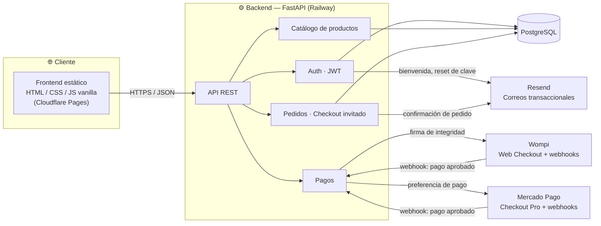

<div align="center">

# 🌹 JG Parfums

**Tienda de perfumes de nicho construida con FastAPI, PostgreSQL y JavaScript vanilla**

Autenticación · Catálogo · Carrito · Checkout (registrado e invitado) · Pagos (Wompi + Mercado Pago) · Panel administrativo

### 🔗 [jg-parfums.pages.dev](https://jg-parfums.pages.dev) — frontend en línea, en construcción

[](https://www.python.org/)
[](https://fastapi.tiangolo.com/)
[](https://www.postgresql.org/)
[](https://www.sqlalchemy.org/)
[](https://alembic.sqlalchemy.org/)
[](#)
[](https://railway.app/)
[](https://jg-parfums.pages.dev)
[](#-estado-actual)

</div>

---

## 📌 Tabla de contenidos

- [Sobre el proyecto](#-sobre-el-proyecto)
- [Estado actual](#-estado-actual)
- [Qué falta antes de lanzar](#-qué-falta-antes-de-lanzar)
- [Arquitectura](#-arquitectura)
- [Características](#-características)
- [Novedades recientes](#-novedades-recientes)
- [Stack técnico](#-stack-técnico)
- [Estructura del proyecto](#-estructura-del-proyecto)
- [Instalación rápida](#-instalación-rápida)
- [Cómo correr los tests](#-cómo-correr-los-tests)
- [Variables de entorno](#-variables-de-entorno)
- [Despliegue](#-despliegue)

---

## Sobre el proyecto

**JG Parfums** es una tienda online de perfumes originales de nicho para el mercado colombiano. El sitio se construyó siguiendo un manual de marca real (`BRAND.md`) — paleta Ónix/Oro/Marfil, tipografía Bodoni Moda + Jost, reglas explícitas de uso del dorado — en vez de un estilo genérico de e-commerce.

El backend expone una API REST con **FastAPI** sobre **PostgreSQL** (SQLAlchemy 2.x, patrón síncrono), y el frontend es **HTML, CSS y JavaScript vanilla**, sin frameworks ni paso de build.

## Estado actual

**El sitio todavía no está vendiendo.** El código de tienda (catálogo, carrito, checkout, pagos, cuentas, panel admin) está construido y probado, pero falta contenido real del cliente, credenciales de producción y conectar el backend a su hosting.

| Módulo | Estado |
|---|---|
| Backend (auth, catálogo, pedidos, pagos, admin) | ✅ Construido y probado (23 tests, contra Postgres real) |
| Migraciones aplicadas en la base de datos de producción | ✅ Aplicadas en Railway |
| Frontend (13 páginas: tienda, cuenta, panel admin) | ✅ Construido |
| Frontend desplegado (Cloudflare Pages) | ✅ En línea — [jg-parfums.pages.dev](https://jg-parfums.pages.dev) |
| Backend desplegado (Railway) | ⏳ Pendiente de conectar el repo |
| Pago con Wompi | ⏳ Código listo — faltan credenciales reales del comercio |
| Pago con Mercado Pago | ⏳ Código listo — faltan credenciales reales |
| Correos transaccionales (Resend) | ⏳ Código listo — falta API key y dominio de envío verificado |
| Catálogo con productos reales | ❌ Vacío — falta contenido y fotografía del cliente |
| Política de tratamiento de datos / términos | ❌ Pendiente (obligatorio en Colombia, Ley 1581 de 2012) |
| Dominio propio | ❌ Pendiente — usando `*.pages.dev` por ahora |

## Qué falta antes de lanzar

**Bloqueante para vender:**
- [ ] Conectar el backend en Railway al repo (`backend/` como root directory) y generar su dominio público
- [ ] Credenciales de producción de Wompi y Mercado Pago
- [ ] Catálogo real: nombre, casa, notas, precio, stock y fotografía de cada perfume
- [ ] Página de política de tratamiento de datos personales y términos de compra

**No bloqueante, pero pendiente:**
- [ ] API key de Resend + dominio verificado para correos transaccionales
- [ ] Confirmar tono "tú/usted" del copy (hoy en "tú" por defecto)
- [ ] Definir costo y política de envío (hoy el checkout cobra solo el subtotal)
- [ ] Dominio propio (ej. `jgparfums.com`) en vez de los subdominios de Railway/Cloudflare

## Arquitectura



## Características

<table>
<tr>
<td valign="top" width="50%">

### Frontend

- Home con catálogo destacado
- Catálogo con filtros (familia olfativa, búsqueda, orden por precio)
- Ficha de producto: galería, notas olfativas, stock, selector de cantidad
- Carrito persistido en el navegador (`localStorage`)
- Checkout con datos de envío y elección de pasarela de pago
- Cuentas de usuario opcionales + checkout invitado
- Historial de pedidos para usuarios registrados
- Panel administrativo (SPA con tabs): productos y pedidos

</td>
<td valign="top" width="50%">

### Backend

- API REST con FastAPI y autenticación JWT
- Registro/login/recuperación de contraseña sin enumeración de cuentas
- Gestión de productos e imágenes (catálogo)
- Pedidos con descuento de stock transaccional
- Integración con Wompi (firma de integridad + verificación de checksum de webhook)
- Integración con Mercado Pago (preferencias + verificación HMAC de webhook)
- Envío de correos transaccionales centralizado (Resend)
- Rate limiting en endpoints sensibles (login, registro, checkout)
- Suite de tests contra SQLite en memoria, sin tocar servicios externos

</td>
</tr>
</table>

## Novedades recientes

> Changelog de la construcción inicial del proyecto.

- Backend completo construido desde cero: modelos, rutas, servicios de pago y auth, siguiendo el esqueleto de `ARQUITECTURA_BASE.md`.
- 23 tests automatizados (pytest + SQLite en memoria) cubriendo auth, productos, pedidos y pagos.
- Migración inicial de Alembic generada, probada con un ciclo completo `upgrade → downgrade → upgrade` contra Postgres real en Docker — se encontró y corrigió un bug real: los tipos ENUM nativos de Postgres no se borraban en el downgrade, lo que rompía un re-upgrade.
- Corrección de un bug de enrutamiento: los webhooks `/payments/wompi/webhook` y `/payments/mercadopago/webhook` quedaban tapados por las rutas dinámicas `/payments/wompi/{order_number}` — Starlette resuelve rutas en orden de registro.
- Frontend completo (13 páginas) construido siguiendo `BRAND.md` al pixel: tokens de color, tipografía, espaciado y componentes exactos del manual de marca.
- Mockup visual del sitio (home, catálogo, ficha de producto — móvil y escritorio) revisado contra `BRAND.md` y corregido: estrella del hero con núcleo equivocado para fondo oscuro, subtítulos en la tipografía de display por debajo del tamaño mínimo permitido, contraste insuficiente en el contador del carrito, y un espaciado fuera de la escala de 4px.
- Base de datos de producción migrada en Railway (7 tablas), verificada contra la base real antes y después de aplicar el esquema.
- Repositorio transferido de la cuenta personal del desarrollador a la cuenta de GitHub del cliente (`jgparfumscol-dev`).
- Frontend desplegado en Cloudflare Pages.

## Stack técnico

| Categoría | Tecnología |
|---|---|
| **Lenguaje** | Python 3.12 |
| **Framework backend** | FastAPI + Uvicorn |
| **ORM / Base de datos** | SQLAlchemy 2.x (síncrono) + PostgreSQL |
| **Migraciones** | Alembic |
| **Auth** | JWT (python-jose) + bcrypt |
| **Frontend** | HTML5, CSS3, JavaScript vanilla — sin build step |
| **Pagos** | Wompi + Mercado Pago |
| **Email transaccional** | Resend |
| **Rate limiting** | slowapi (por IP, en endpoints de auth y checkout) |
| **Infraestructura** | Railway (backend) · Cloudflare Pages (frontend) |

## 📁 Estructura del proyecto

```
.
├── backend/
│   ├── routes/          # auth, products, orders, payments
│   ├── models/           # Modelos SQLAlchemy
│   ├── schemas/           # Esquemas Pydantic
│   ├── services/           # Wompi, Mercado Pago, email
│   ├── middleware/           # Auth (JWT) y dependencias de rol
│   ├── alembic/                # Migraciones de base de datos
│   └── tests/                   # pytest, SQLite en memoria
├── frontend/          # Páginas HTML, css/ y js/ compartidos
├── Logos/             # Assets de marca originales (manual de marca en PDF)
└── BRAND.md           # Manual de marca — fuente de verdad de diseño
```

## Instalación rápida

```bash
# 1. Backend
cd backend
python -m venv venv
source venv/bin/activate      # En Windows: venv\Scripts\activate
pip install -r requirements.txt
cp .env.example .env           # completar con credenciales reales
alembic upgrade head
uvicorn main:app --reload

# 2. Frontend
# Servir frontend/ con cualquier servidor estático local, ej.:
cd frontend && python -m http.server 8000
```

## Cómo correr los tests

La suite de pytest corre contra una base de datos SQLite en memoria y nunca toca `DATABASE_URL` real ni servicios externos (Wompi, Mercado Pago y Resend quedan mockeados o deshabilitados en el entorno de test).

```bash
cd backend
pip install -r requirements-dev.txt

pytest                     # correr toda la suite
pytest --cov=.             # con reporte de cobertura (usa backend/.coveragerc)
pytest tests/test_payments.py -v   # un archivo puntual
```

## Variables de entorno

| Variable | Propósito |
|---|---|
| `DATABASE_URL` | Cadena de conexión a PostgreSQL |
| `SECRET_KEY` | Firma de tokens JWT |
| `FRONTEND_URL` | Origen permitido para CORS |
| `BACKEND_URL` | Usado para armar la `notification_url` de Mercado Pago |
| `WOMPI_PUBLIC_KEY` / `WOMPI_INTEGRITY_SECRET` / `WOMPI_EVENTS_SECRET` | Integración de pagos con Wompi |
| `MERCADOPAGO_ACCESS_TOKEN` / `MERCADOPAGO_WEBHOOK_SECRET` | Integración de pagos con Mercado Pago |
| `RESEND_API_KEY` / `EMAIL_FROM` | Envío de correos transaccionales vía Resend |

> No se incluyen credenciales ni secretos en este repositorio — ver `backend/.env.example`.

## Despliegue

- **Backend** → Railway (pendiente de conectar el repo — ver [Qué falta antes de lanzar](#-qué-falta-antes-de-lanzar))
- **Frontend** → Cloudflare Pages, en línea en [jg-parfums.pages.dev](https://jg-parfums.pages.dev)
- **Base de datos** → PostgreSQL en Railway, esquema ya migrado
- **Seguridad** → CORS con orígenes explícitos, rate limiting por IP en auth/checkout, sin enumeración de cuentas en registro/login/forgot-password

---

<div align="center">

Proyecto en construcción. Ver [Qué falta antes de lanzar](#-qué-falta-antes-de-lanzar) para el estado real de cara al lanzamiento.

</div>
