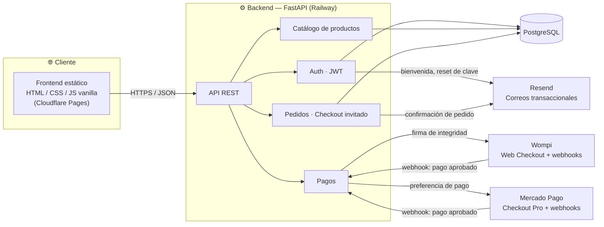

<div align="center">

# 🌹 JG Parfums

**Tienda de perfumes de nicho construida con FastAPI, PostgreSQL y JavaScript vanilla**

Autenticación · Catálogo · Categorías · Decants (5ml/10ml) · Carrito · Checkout (registrado e invitado) · Pagos (Wompi + Mercado Pago) · Panel administrativo con tienda en vivo editable

### 🔗 [jgparfums.com.co](https://jgparfums.com.co) — frontend y backend en línea, en construcción

[](https://www.python.org/)
[](https://fastapi.tiangolo.com/)
[](https://www.postgresql.org/)
[](https://www.sqlalchemy.org/)
[](https://alembic.sqlalchemy.org/)
[](#)
[](https://railway.app/)
[](https://jg-parfums.pages.dev)
[](#-estado-actual)

</div>

---

## 📌 Tabla de contenidos

- [Sobre el proyecto](#-sobre-el-proyecto)
- [Estado actual](#-estado-actual)
- [Qué falta antes de lanzar](#-qué-falta-antes-de-lanzar)
- [Arquitectura](#-arquitectura)
- [Características](#-características)
- [Novedades recientes](#-novedades-recientes)
- [Stack técnico](#-stack-técnico)
- [Estructura del proyecto](#-estructura-del-proyecto)
- [Instalación rápida](#-instalación-rápida)
- [Cómo correr los tests](#-cómo-correr-los-tests)
- [Variables de entorno](#-variables-de-entorno)
- [Despliegue](#-despliegue)

---

## Sobre el proyecto

**JG Parfums** es una tienda online de perfumes originales de nicho para el mercado colombiano. El sitio se construyó siguiendo un manual de marca real (`BRAND.md`) — paleta Ónix/Oro/Marfil, tipografía Newsreader + Jost, reglas explícitas de uso del dorado — en vez de un estilo genérico de e-commerce.

El backend expone una API REST con **FastAPI** sobre **PostgreSQL** (SQLAlchemy 2.x, patrón síncrono), y el frontend es **HTML, CSS y JavaScript vanilla**, sin frameworks ni paso de build.

## Estado actual

**El sitio todavía no está vendiendo.** El pipeline técnico completo (frontend, backend, base de datos, correos, pagos) ya está en línea, probado de punta a punta y con credenciales reales de producción. Lo que falta es contenido real del cliente.

| Módulo | Estado |
|---|---|
| Backend (auth, catálogo, categorías, marcas, decants, notas, pedidos, pagos, ajustes, mensajes de contacto, admin) | ✅ Construido y probado (144 tests, SQLite en CI / Postgres real en producción) |
| Backend desplegado (Railway) | ✅ En línea — `jg-parfums-production.up.railway.app` |
| Migraciones aplicadas en la base de datos de producción | ✅ Aplicadas en Railway |
| Decants (5ml/10ml por producto, precio y stock propios) | ✅ Backend, panel admin y ficha de producto construidos y probados |
| Notas de producto libres (nombre + color por nota, escalera con la más fuerte abajo) | ✅ Backend, panel admin y ficha de producto/hero construidos y probados |
| Categorías y estadísticas propias de tráfico (sin cookies ni datos personales) | ✅ Backend, panel admin y filtro de catálogo construidos y probados |
| Panel admin: tienda en vivo editable (secciones de página: banner con varias fotos, galería, anuncio, testimonios, contadores, etc.) y Ajustes de marca (nombre, color, tipografía, contacto/redes, envío) | ✅ Construido y probado |
| Secciones fijas de cada página (hero, encabezados, bloque de decants, manifiesto) editables desde el panel, con historial de versiones y restauración | ✅ Backend, panel admin y sitio público construidos y probados |
| Producto destacado del home seleccionable con una estrella en el panel (en vez de elegirse solo, al azar) | ✅ Construido y probado |
| Ficha de producto avanzada: descripción destacada, acordeón de info específica del perfume, botón de compra directa, foto propia por presentación/variante, bloques de foto/GIF con texto superpuesto configurables | ✅ Backend, panel admin y sitio público construidos y probados |
| Páginas institucionales editables desde el panel: Envíos y políticas, Contacto (con formulario que guarda mensajes revisables en el panel) y Quiénes somos | ✅ Construido y probado |
| Frontend (tienda, cuenta, panel admin) | ✅ Construido — sistema de diseño documentado (`DESIGN.md`), tipografía de títulos Newsreader (legible en cualquier densidad de pantalla), acentos circulares para romper la retícula sin tocar el radio duro de botones/tarjetas |
| Frontend desplegado (Cloudflare Pages) | ✅ En línea — dominio propio [jgparfums.com.co](https://jgparfums.com.co) |
| Home: carrusel de clases y carrusel de marcas (modo flechas o continuo con velocidad y sentido configurables, arrastrable con el dedo o el cursor), galería de fotos y banner con arrastre táctil/mouse — ancho del bloque y espaciado de sección configurables en los tres | ✅ Backend, panel admin y sitio público construidos y probados |
| Fricción básica contra copiar/descargar fotos en la tienda pública (sin clic derecho, sin arrastrar, sin guardar al mantener presionado en celular) | ✅ Construido — el panel admin no se ve afectado |
| CORS frontend ↔ backend | ✅ Verificado con petición real |
| Correos transaccionales (Resend) | ✅ Confirmado de punta a punta (registro → correo de bienvenida recibido) |
| Pago con Wompi | ✅ Credenciales de producción configuradas — flujo de pago completo probado |
| Pago con Mercado Pago | ✅ Credenciales de producción configuradas — flujo de pago completo probado |
| Catálogo con productos reales | ⏳ Productos de prueba cargados — falta contenido y fotografía real del cliente |
| Política de tratamiento de datos / términos | ❌ Pendiente (obligatorio en Colombia, Ley 1581 de 2012) |
| Dominio propio | ⏳ Frontend ya en [jgparfums.com.co](https://jgparfums.com.co) — el backend sigue en el subdominio de Railway (`*.up.railway.app`) |

## Qué falta antes de lanzar

**Bloqueante para vender:**
- [ ] Catálogo real: nombre, casa, notas, precio, stock y fotografía de cada perfume (hoy tiene productos de prueba, sin fotos)
- [ ] Página de política de tratamiento de datos personales (Habeas Data, Ley 1581 de 2012) — distinta de la página de Envíos y políticas de cambio ya construida, que cubre devoluciones/garantía (Ley 1480), no manejo de datos personales
- [ ] Verificar un dominio propio en Resend (hoy los correos salen desde `onboarding@resend.dev`, su dirección de pruebas, que solo entrega a la cuenta dueña de la API key — no a clientes reales)

**No bloqueante, pero pendiente:**
- [ ] Borrar la cuenta admin y los productos de prueba antes de lanzar
- [ ] Confirmar tono "tú/usted" del copy (hoy en "tú" por defecto)
- [ ] Cargar el costo de envío real en Ajustes (el campo ya existe y el checkout ya lo suma; hoy está en 0 por defecto)
- [ ] Dominio propio para el backend (hoy `*.up.railway.app`) — el del frontend ya está listo (`jgparfums.com.co`)
- [ ] Revisar las fotos del carrusel de clases del home: algunas quedaron apuntando a enlaces de resultados de imágenes de Google/Brave en vez de a fotos propias hospedadas — no son estables para hotlinking (pueden dejar de verse sin aviso) y conviene reemplazarlas por las fotos reales del cliente subidas a un storage propio

## Arquitectura



## Características

<table>
<tr>
<td valign="top" width="50%">

### Frontend

- Home: producto destacado (elegido con una estrella en el panel, no al azar) como ficha técnica interactiva, con sus notas olfativas reales en una escalera de barras (más fuerte abajo), grilla de recién llegados, bloque de decants; sin ningún producto marcado, la ficha se queda con copy genérico de la tienda en vez de mostrar una marca de perfume puntual
- Header transparente en la portada, flotando sobre el banner (degradado sutil + logo/íconos en blanco) hasta que se hace scroll, donde pasa al header sólido de vidrio esmerilado de siempre
- Banner con una o varias fotos: rotación configurable, transición de "empuje" suave entre fotos, arrastre con el dedo o el mouse además de flechas, posición del texto (izquierda/centro/derecha), oscurecido y desenfoque por foto, proporción fija (sin marco nunca, se recorta si hace falta)
- Sección de galería de fotos (grid, carrusel manual, comparar una al lado de la otra, o una sola foto), con el mismo texto/botón/oscurecido/desenfoque superpuesto por imagen que el banner más posición vertical del texto (arriba/medio/abajo), zoom leve en hover/foco, y ancho del bloque (contenido o completo) y espaciado de sección configurables
- Carrusel de clases (categorías con foto, eyebrow, oscurecido, desenfoque y posición de texto configurables) que enlaza cada tarjeta al catálogo ya filtrado, y carrusel de marcas (logos en escala de grises) — ambos con ancho del bloque y espaciado de sección configurables, modo flechas (zoom en hover/foco, deslizamiento nativo al dedo, siempre en bucle) o modo continuo (deslizamiento infinito con velocidad y sentido configurables, arrastrable con el dedo o el cursor sin perder la pausa al pasar por encima), y respeto de `prefers-reduced-motion`
- Barra de anuncios con rotación (fundido real o deslizamiento direccional configurable), variantes de color, y mensajes con fecha de vigencia
- Catálogo con filtros (categoría, rango de precio, búsqueda, orden por precio, solo con decant disponible)
- Ficha de producto: galería (con foto propia por presentación si se configura), notas olfativas en escalera, selector de presentación (frasco completo o decant de 5ml/10ml) con stock propio, descripción destacada, listados desplegables (acordeón) con info específica del perfume, bloques de foto/GIF con texto superpuesto configurables, botón de compra directa además de agregar al carrito
- Carrito persistido en el navegador (`localStorage`), con una línea independiente por presentación
- Checkout con datos de envío, costo de envío configurable y elección de pasarela de pago
- Cuentas de usuario opcionales + checkout invitado
- Historial de pedidos para usuarios registrados
- Páginas institucionales editables desde el panel: Envíos y políticas de cambio (una sola página), Contacto (formulario que guarda el mensaje + enlace directo a WhatsApp) y Quiénes somos
- Footer con iconos de métodos de pago y, si el admin los configura en Ajustes, iconos de WhatsApp/Instagram/TikTok que enlazan directo a esas cuentas
- Panel administrativo (SPA de 3 columnas): editor de "tienda en vivo" (secciones de página administrables — banner, galería, carrusel de clases, carrusel de marcas, anuncio, testimonios, contadores, categorías, footer — con vista previa en vivo por dispositivo), productos (notas, decants, destacado, desactivar/eliminar), pedidos, pestaña Clases (antes "Categorías": foto, eyebrow, oscurecido, desenfoque, posición de texto, activar/reordenar), pestaña Marcas (logo, enlace, activar/reordenar), mensajes de contacto, métricas propias y ajustes de marca (nombre, color de acento, tipografía, contacto/redes, envío)
- Las secciones fijas de cada página (hero, "Recién llegados", bloque de decants, manifiesto de marca, encabezados) también son editables/ocultables/eliminables desde el mismo panel, con historial de versiones y restauración de un clic

</td>
<td valign="top" width="50%">

### Backend

- API REST con FastAPI y autenticación JWT
- Registro/login/recuperación de contraseña sin enumeración de cuentas
- Gestión de productos, imágenes y notas olfativas (nombre + color libres por nota, ordenables)
- Categorías de producto ("clases" de cara al admin), con filtro en catálogo, foto/eyebrow/oscurecido/posición de texto propios y orden manual (`sort_order`)
- Marcas (tabla `brands` nueva): logo, enlace opcional, activar/desactivar y orden manual, con endpoint público que solo devuelve las activas ordenadas
- Secciones de página administrables desde el panel (`page_sections`), tanto agregadas libremente (incluye banner de varias fotos, galería, carrusel de clases y carrusel de marcas) como las partes fijas originales de cada página (hero, encabezados, decants, manifiesto) — mismo mecanismo para todas, y también para las páginas institucionales nuevas (envíos/políticas, contacto, quiénes somos)
- Historial de versiones (`page_section_history`): cada creación/edición/borrado queda guardado con una copia completa del contenido y se puede restaurar, incluso si la sección ya fue borrada
- Producto destacado (`is_featured`): al marcar uno se desmarca cualquier otro automáticamente — solo puede haber uno a la vez, es el que alimenta la ficha del home
- Mensajes de contacto (`contact_messages`): guarda lo que dejan los visitantes en `/contacto.html`, con límite de tasa por IP contra spam; el admin los marca como leídos o los elimina desde el panel
- Ajustes de marca en una fila única (`site_settings`): color de acento (regenera toda la escala dorada), tipografía, datos de contacto/redes y costo de envío
- Estadísticas propias de tráfico (sin cookies, IP ni user-agent) para el panel de Métricas
- Decants por producto (5ml/10ml): precio y stock propios, foto propia opcional por presentación, independientes del frasco completo
- Info adicional y media de la ficha de producto (`product_detail_sections`, `product_media_items`): listados desplegables y bloques de foto/GIF con texto superpuesto, oscurecido, desenfoque, alto y ancho configurables, ordenables, editables desde "Editar" en Productos
- Pedidos con descuento de stock transaccional (respeta la presentación comprada: frasco completo o decant) y costo de envío configurable
- Borrado de producto en dos niveles: desactivar (oculta de la tienda, reversible) o eliminar permanentemente (hard delete; los pedidos ya guardan su propio snapshot de nombre/precio, así que no se pierde el historial)
- Integración con Wompi (firma de integridad + verificación de checksum de webhook)
- Integración con Mercado Pago (preferencias + verificación HMAC de webhook)
- Envío de correos transaccionales centralizado (Resend)
- Rate limiting en endpoints sensibles (login, registro, checkout, mensajes de contacto)
- Suite de tests (144) contra SQLite en memoria, sin tocar servicios externos

</td>
</tr>
</table>

## Novedades recientes

> Changelog de la construcción inicial del proyecto.

- El chatbot ahora responde sobre los pedidos del cliente cuando hay sesión iniciada. `POST /chat/message` sigue con autenticación opcional (JWT en `Authorization: Bearer`, o visitante anónimo sin token o con uno vencido/inválido — nunca un 401), pero el payload hacia n8n cambia: en vez del `context` con nombre/correo/pedidos anidados, ahora manda `"is_logged_in": bool` y `"customer_context": str` (texto plano, recortado a ~2000 caracteres, vacío si no hay sesión) con solo lo mínimo por pedido — número, fecha, estado en español (pendiente de pago/pagado/en preparación/enviado/entregado/cancelado), productos con su presentación (frasco o decant) y cantidad, y total. Nunca dirección, teléfono, correo, documento ni datos de pago/pasarela — el `user_id` sale únicamente del JWT, jamás del body, así que un cliente no puede pedir el contexto de otro. El header del secreto compartido pasa a llamarse `X-Chat-Secret` (antes `X-Webhook-Secret`), el nombre real que espera el nodo Webhook de n8n. En el widget: `apiFetch` ya mandaba el token si había sesión; ahora, además, el `session_id` y el historial visible del chat pasan de `localStorage` a `sessionStorage` y se resetean en cada login/logout (`resetChatSession`, ver `js/api.js`) para que la memoria de una cuenta —tanto la del navegador como la de n8n, que usa ese mismo `session_id` como llave— no se filtre a otra en el mismo navegador. Saludo configurable por separado para con/sin sesión (con sesión, por default, ofrece ayuda con pedidos), y las respuestas del bot ahora reconocen enlaces propios en texto plano (ej. `/login`) y los vuelven clicables. 4 tests nuevos (162 en total).
- Las variables del chatbot pasan a llamarse `N8N_CHAT_WEBHOOK_URL`/`N8N_CHAT_WEBHOOK_SECRET` (antes `N8N_WEBHOOK_URL`/`N8N_WEBHOOK_SECRET`) para no chocar con otros usos genéricos de "n8n" en el entorno. Si se pega solo el dominio de Railway sin `https://` adelante, se le antepone solo — pero igual hace falta completarlo con la ruta del webhook (`/webhook/...` del nodo Webhook del workflow en n8n), el dominio solo no alcanza para pegarle a un workflow puntual. 1 test nuevo (158 en total).
- Chatbot conectado a n8n: nueva sección administrable "Chat" (+ Añadir sección, cualquier página) con burbuja fija + panel desplegable — lado, distancia del borde inferior, tamaño (compacto/amplio, a propósito chicos) y color configurables desde el editor, con los colores de marca de default. `POST /chat/message` (nuevo, backend) reenvía el mensaje al webhook de n8n (`N8N_WEBHOOK_URL`/`N8N_WEBHOOK_SECRET`); si hay sesión activa, el backend arma el contexto (nombre, pedidos recientes) del lado del servidor y se lo manda a n8n — nunca el token del usuario, así n8n no puede actuar en su nombre. Funciona igual con o sin sesión, y se adapta a un panel tipo hoja en móvil. Corregidos dos bugs reales de paso: `get_optional_user` tumbaba con 401 cualquier ruta "opcional" ante un token vencido en vez de tratarlo como visitante anónimo (afectaba a más rutas que el chat, ver middleware/auth.py), y el listado fijo de tipos de sección del backend (`SectionType`) no iba a aceptar ningún tipo nuevo que no se le agregara ahí a mano. 7 tests nuevos.
- Un producto ahora puede estar en una, varias o ninguna clase (antes una sola, `category_id`) — tabla puente `product_categories` nueva, con migración que respeta las asignaciones existentes (a cada producto le queda la clase que ya tenía) y con reversa simétrica si hace falta bajar de versión. El campo "Categoría" de la ficha de producto en el panel pasa a ser un grupo de casillas ("Clases"). El filtro del catálogo (`?category_id=`) y "También te puede interesar" (ahora busca por todas las clases del producto, no solo una) siguen funcionando igual de cara al visitante. Se suma la creación automática de cuenta al comprar como invitado (sin el correo de bienvenida de /registro) para que el pedido quede en el historial — entra después con "Olvidé mi contraseña" usando ese mismo correo. Corregido de paso un bug real preexistente: `models/__init__.py` no importaba `ProductDetailSection` ni `ProductMediaItem`, así que un `alembic revision --autogenerate` corrido en un proceso que no pasara por `main.py` primero no habría detectado cambios en esas dos tablas. Un botón "Ver usuarios" nuevo en Pedidos (panel admin) lista las cuentas registradas. 4 tests nuevos en categorías + 3 en pedidos + 2 en usuarios (151 en total).
- En login/registro/recuperar/restablecer contraseña, en móvil los labels "Correo"/"Contraseña" y el texto "¿No tienes cuenta?..." usaban el gris muted de siempre (pensado para fondo blanco sólido) y se leían peor que el título contra la foto de fondo, aun con el halo de texto — ahora llevan el mismo negro que el título. Sin cambios en escritorio.
- La sección administrable "Productos" separa la cantidad de productos a mostrar en móvil/tablet de la de PC/escritorio (antes un único número para las dos) — se decide según el ancho de pantalla al cargar la página, mismo criterio que la cantidad de columnas. Pensado para poder elegir números que llenen filas completas en cada tamaño (ej. 6 en móvil a 3 columnas, 8 en escritorio a 4) en vez de dejar la última fila coja.
- La sección administrable "Productos" (+ Añadir sección, cualquier página) ahora soporta tres formas de mostrarlos — grilla, lista compacta en fila o carrusel con flechas, mismo vocabulario que ya tenía "También te puede interesar" — y una cantidad de productos por fila en móvil configurable (1 a 4, con tablet/escritorio fijos en 3/4 como el resto del sitio); en carrusel ese mismo número controla cuántas tarjetas entran por pantalla en móvil.
- Catálogo: la cantidad de productos por fila en móvil (2 a 4) ahora se configura desde el editor de la sección fija de título del catálogo. Corregido de paso un bug real de la grilla: por default un ítem de CSS Grid no se achica más allá del ancho mínimo de su contenido, así que con 3-4 columnas el nombre o el precio de un producto largo empujaba esa columna a desbordar y toda la grilla se corría hacia la derecha (columnas dispares, scroll horizontal). Con la separación entre la paginación "Anterior/Siguiente" y el footer, que quedaban pegados.
- Login, registro, recuperar y restablecer contraseña rediseñados a pantalla dividida en escritorio (form + foto a alto completo, sin scroll de página, foto enmarcada con esquinas redondeadas) y con la foto de fondo real —sin overlay opaco, contraste del texto resuelto con un halo por `text-shadow` en vez de una capa sólida— en móvil/tablet. "Mi cuenta" sin sesión redirige directo a login en vez de mostrar una tarjeta intermedia.
- La sección fija "También te puede interesar" de la ficha de producto ahora es configurable desde el editor: cantidad de productos (2 a 12), forma de mostrarlos (grilla, lista compacta en fila o carrusel con flechas) y una clase/categoría fija en vez de la detección automática de siempre (misma clase del producto, con relleno de recientes si hay pocos) — el producto actual se excluye siempre de sus propios relacionados. En el editor de productos, un botón "Ver todas las notas guardadas" abre el catálogo completo de notas olfativas usadas en cualquier producto (deduplicadas por nombre) con la opción de eliminar una de todos los productos que la usan a la vez, en vez de tener que entrar producto por producto a sacarla.
- El campo para agregar una nota olfativa nueva ahora sugiere (autocompletado) las que ya se usaron en cualquier producto y recupera su color guardado en vez de pedir elegirlo de nuevo cada vez que se repite entre perfumes — antes tocaba escribirla desde cero aunque ya existiera. La sesión del panel admin (mismo token de auth que las cuentas de cliente) se extiende de 30 a 60 minutos: se estaba cerrando en medio de la carga de productos.
- En todas las páginas menos home, el header ahora se oculta al bajar y reaparece apenas se sube, en vez de quedarse fijo siempre ocupando espacio. El breadcrumb "Volver al catálogo/carrito" (ficha de producto y checkout) usa el historial real del navegador cuando el visitante viene de la misma tienda, así "atrás" lleva a la página real anterior (ej. el inicio) en vez de siempre al catálogo/carrito fijo.
- Ancho del bloque (contenido/ancho completo) y espaciado de sección (normal/compact/flush) agregados al carrusel de marcas, mismo criterio que ya tenía el de clases desde antes — el default (`contained`/`normal`) preserva exactamente el aspecto de las secciones ya guardadas. 3 tests nuevos (144 en total).
- Ancho del bloque configurable también en la galería de fotos (antes fijo por modo de visualización: grid siempre contenida, carrusel/comparar/una foto siempre a todo el ancho — ahora el admin puede invertirlo) y velocidad del modo continuo (clases y marcas) configurable en tres pasos (lenta/normal/rápida) en vez de fija. 4 tests nuevos (141 en total).
- El carrusel en modo continuo (clases y marcas) ahora se puede arrastrar con el dedo o el cursor sin perder la pausa al pasar por encima, en cualquier momento — se reescribió el motor de puro CSS (`@keyframes`) a JavaScript con `requestAnimationFrame`, la única forma de tomar el control exacto de la posición durante el arrastre y devolverle el control a la animación al soltar, desde donde quedó.
- Dos bugs reales corregidos en el carrusel continuo recién agregado: (a) la pista duplicada para el loop infinito no se recortaba en ningún punto y empujaba el ancho de toda la página, dejando una barra de scroll horizontal — se arregló con `overflow:hidden` en el contenedor (no en la pista, que lo necesita visible para el arrastre); (b) el modo "continuo" nunca quedaba guardado porque el esquema de validación del backend no declaraba `carousel_mode`/`carousel_direction` como campos — Pydantic los descartaba en silencio al guardar, y por eso el admin veía "Continuo" volver a "Flechas" cada vez que reabría la sección. 3 tests nuevos (137 en total).
- Ficha de producto: título "Descripción" agregado sobre el texto (antes sin encabezado propio) con más aire respecto al bloque de compra, y opción de desplazamiento continuo (infinito, sin parar, con sentido configurable) sumada al modo flechas de siempre en la sección de carrusel de clases del editor.
- Personalización avanzada de fichas de producto: descripción a todo el ancho debajo de la ficha, listados desplegables (acordeón) para info específica del perfume (`product_detail_sections`), botón de "Comprar ahora" además de "Agregar al carrito", foto propia por presentación/variante, y bloques de foto/GIF con texto superpuesto (`product_media_items`: oscurecido, desenfoque, alto y ancho configurables) — todo editable desde "Editar" en la sección de Productos del panel. 13 tests nuevos (134 en total).
- Corregido un bug real: el footer (estático en el HTML) podía verse pegado al header por un instante al entrar a cualquier página, porque `#dynamicSections` arranca vacío hasta que resuelve el fetch a `/page-sections` — durante ese instante no había nada entre los dos. El footer ahora arranca invisible (`opacity:0`) y `renderPageSections` lo revela con un fade corto al terminar, salga bien o mal el fetch (para no dejarlo escondido para siempre si falla).
- Fricción básica contra copiar/descargar fotos en la tienda pública: sin clic derecho ni arrastrar la imagen, sin el menú de guardar al mantener presionado en celular — el panel admin no se ve afectado (`site-settings.js` no se carga ahí). No es protección real (cualquiera puede tomar una captura de pantalla), es solo un desincentivo; a propósito no se toca el zoom nativo del navegador (pellizcar/doble-tap), que además de ayudar a vender es mala práctica de accesibilidad desactivarlo y ni siquiera funciona en iOS Safari.
- Espaciado de sección y proporción de foto configurables en el carrusel de clases y la galería: `spacing` (normal / compact / flush, mismas variantes `.section--compact`/`.section--flush` para ambas) para achicar el aire arriba/abajo del bloque, y proporción ancho:alto de la foto (`card_ratio_w`/`card_ratio_h` en clases, `image_ratio_w`/`image_ratio_h` opcional en galería) para recortarlas más finas — ambos vía `aspect-ratio` con custom properties, sin tocar el resto de secciones. 4 tests nuevos (122 en total).
- Galería de fotos: posición vertical del texto superpuesto (arriba/medio/abajo, sumada a la horizontal que ya existía) y zoom leve en hover/foco sobre la imagen, misma excepción acotada que las tarjetas de clase. Banner: se navega arrastrando con el dedo o el mouse (Pointer Events) además de con flechas nuevas. Carrusel de clases: opción de ancho del bloque (contenido, de siempre, o ancho completo — rompe el container y toca los bordes de la pantalla). 2 tests nuevos (119 en total).
- Menú de clases del header rehecho: la fila de links en línea (se veía apretada con más de 3-4 clases) pasa a un botón que abre un panel flotante, solo en escritorio — el panel móvil sigue igual. Flechas de los carruseles de clases/marcas rediseñadas sin caja (antes un cuadro blanco) y siempre en bucle. En el camino se encontró y corrigió un bug real: un comentario CSS con `(--pgs-cards-*/--pgs-logos-*)` se cerraba solo por el `*/` accidental en medio del texto, así que el navegador descartaba la regla completa de `.pgs-carousel-wrap { position: relative; }` — las flechas del carrusel de clases quedaban ancladas arriba de la página en vez de centradas en las fotos. Se agrega además versión (`?v=`) a los `<link>`/`<script>` de CSS/JS compartidos: sin eso, un deploy nuevo podía tardar hasta 4 horas en verse para quien ya había visitado el sitio (`max-age=14400` del CDN).

- Dos secciones nuevas para el editor de "tienda en vivo": carrusel de clases (`classes_carousel`) y carrusel de marcas (`brands_carousel`), pensado este último para ir justo debajo del de clases. `Category` se extiende con foto/eyebrow/nombre de tarjeta/oscurecido/posición de texto/orden/activo (pestaña del panel renombrada de "Categorías" a "Clases", sin tocar la tabla ni la ruta); tabla `brands` nueva con el mismo patrón de admin, sin datos de ejemplo precargados. Ambos carruseles comparten un módulo de scroll-snap en `sections.js` (deslizamiento nativo al dedo, flechas que se deshabilitan en los extremos), con zoom en hover/foco sobre la imagen —excepción acotada a estas tarjetas de la regla general "nunca transform en hover", documentada en `DESIGN.md`— y respeto de `prefers-reduced-motion` (el modo "continuo" de marcas cae a manual sin animación). El catálogo no tiene filtro estructurado por marca hoy (`Product.house` es texto libre): el enlace de cada logo es `link_url` libre, no un filtro automático. 24 tests nuevos (115 en total).
- Páginas institucionales nuevas y editables desde el panel: Envíos y políticas (fusionadas en una sola página tras probarse por separado — el admin prefirió un solo destino), Contacto (formulario que guarda el mensaje en `contact_messages`, con una pestaña "Mensajes" nueva en el panel para marcarlos leídos o eliminarlos, más un enlace directo a WhatsApp con el número de Ajustes) y Quiénes somos. Footer simplificado: se quitan los enlaces de "Carrito" y "Mi cuenta" (ya accesibles desde los íconos del header) en las 9 páginas que lo tienen.
- Producto destacado del home seleccionable con una estrella en la tabla de Productos del panel (`is_featured`, un único producto a la vez — marcar uno desmarca cualquier otro): antes se elegía solo, el más reciente con notas cargadas, lo que a veces mostraba el nombre de una marca de perfume puntual en vez del copy genérico de la ficha "así se lee un perfume". Sin ningún producto marcado, el home se queda con ese copy genérico.
- Banner rehecho para admitir varias fotos con rotación configurable (antes una sola imagen fija): cada foto con su propio texto, posición (izquierda/centro/derecha), botón, oscurecido (0–100%) y desenfoque (0–20px) configurables, con proporción fija (`aspect-ratio`) para que nunca se genere marco — se recorta la imagen si hace falta, a pedido explícito del cliente tras dos vueltas probando "sin recorte nunca". Transición entre fotos rehecha de un cambio brusco a un deslizamiento de "empuje" suave, con el camino más corto al volver de la última foto a la primera.
- Sección de galería de fotos nueva (`gallery`): grid, carrusel de navegación manual, comparar fotos una al lado de la otra, o una sola foto — con el mismo texto/botón/oscurecido/desenfoque superpuesto por imagen que el banner. Sin botón, el enlace de la foto sigue haciendo clicable la imagen completa (sin anidar `<a>`).
- Barra de anuncios: la transición de "deslizamiento" pasa de un sutil desvanecido con leve corrimiento a un desplazamiento completo y real, con dirección configurable (derecha/izquierda) — nuevo campo `slide_direction`.
- Header transparente en la portada: antes se veía una franja sólida entre la barra de anuncios y el banner; ahora el header flota sobre el banner (degradado sutil + logo/íconos en blanco) mientras no se hace scroll, y pasa al header sólido de vidrio esmerilado de siempre apenas se scrollea. Solo en home, que es la única página con una sección oscura pegada debajo del header.
- Corregido un bug real en la sección de manifiesto de marca: el bloque completo quedaba desbalanceado hacia la izquierda por un margen negativo que compensaba el padding del texto cuando estaba alineado a la izquierda — dejó de aplicar cuando el texto se centró en una corrección anterior, y nadie lo había quitado. 26 tests nuevos entre estas features (91 en total).
- Secciones fijas de cada página (hero de home, "Recién llegados", bloque de decants, manifiesto de marca, encabezado de catálogo, "También te puede interesar" en ficha de producto) convertidas en editables desde el panel — antes eran HTML fijo, ahora se pueden editar, ocultar o eliminar sin tocar código, igual que las secciones agregadas libremente. Se suma un historial de versiones (`page_section_history`): cada cambio queda guardado con una copia completa del contenido y se puede restaurar con un clic, incluso si la sección ya fue borrada — se conecta al botón "Historial" del panel, que ya existía en la interfaz pero estaba deshabilitado. Encontrado y corregido en el camino un bug real: cuando una página no tenía secciones agregadas libremente, los botones de las secciones fijas quedaban sin funcionar (el código cortaba antes de conectar los clics). 5 tests nuevos.
- Título de la tienda de Bodoni Moda a Newsreader: verificado en producción que un didone de contraste tan alto como Bodoni Moda perdía legibilidad contra fondos claros en monitores de escritorio de densidad estándar, incluso en tamaños grandes — el problema no era el tamaño, era el diseño de la tipografía. Se reemplaza por Newsreader (serif editorial de contraste moderado) en todo el sitio vía la variable `--font-display`, y se corrige el nombre de producto en tarjeta (que ya debía ir en Jost según `DESIGN.md` pero estaba implementado en Bodoni a 16px, muy por debajo del piso de legibilidad).
- Botón "Eliminar" de producto: corregido para que borre de verdad (antes solo desactivaba) — `DELETE /products/{id}?hard=true`, seguro porque `order_items` guarda su propio snapshot de nombre/precio y no depende de la fila del producto. Se separó del botón "Desactivar" existente y se agregó manejo de errores visible (antes una falla quedaba completamente silenciosa).
- Footer con iconos de métodos de pago (Visa, Mastercard, Nequi, PSE, Bancolombia, Mercado Pago) e iconos circulares de WhatsApp/Instagram/TikTok que solo aparecen si el admin configuró esa red en Ajustes — corregido un bug real donde los iconos de pago quedaban casi invisibles: un SVG cargado con `` no hereda `currentColor` de la página, así que caían a negro por defecto sobre el fondo oscuro del footer.
- Pase de formas para romper la retícula del home sin tocar el radio duro de botones/tarjetas/campos (regla de marca explícita en `DESIGN.md`): corte diagonal en la esquina del diagrama de notas del hero, numerales en anillo dorado en la tira de manifiesto, punto hueco al final del filete de cada título de sección.
- Notas de producto rediseñadas: de 3 campos fijos de texto (salida/corazón/fondo) a una lista libre de notas individuales, cada una con nombre y color elegidos por el admin, mostrada como una escalera con el tono más fuerte abajo. Tabla `product_notes` nueva, migración con backfill de los datos existentes, 6 tests nuevos.
- Panel admin rediseñado por completo como editor de "tienda en vivo": shell de 3 columnas (secciones a la izquierda, vista previa en vivo con selector de dispositivo al centro, productos/pedidos a la derecha), sistema de `page_sections` (11 tipos: banner, anuncio, testimonios, contadores, etc.) para editar partes de la página sin tocar código, y una pestaña de Ajustes que reconfigura nombre de tienda, color de marca (regenerando toda la escala dorada), tipografía (5 combinaciones curadas), contacto/redes y costo de envío.
- Categorías de producto y estadísticas propias de tráfico (sin cookies, IP ni user-agent), con sus propias pestañas en el panel admin y filtro de categoría en el catálogo.
- Credenciales de producción de Wompi y Mercado Pago configuradas en Railway; flujo de pago completo (checkout → webhook → pedido pagado → correo de confirmación) probado de punta a punta con ambas pasarelas.
- Feature de decants: tabla `product_variants` (precio y stock propios por presentación de 5ml/10ml, independiente del frasco completo), endpoints de admin para gestionarlos, y lógica de checkout que descuenta el stock correcto según la presentación comprada. 6 tests nuevos.
- Sistema de diseño documentado en `DESIGN.md` (formato estándar, con `.impeccable/design.json` como sidecar de tokens) a partir de la identidad ya implementada en `BRAND.md` — nombrado "El cuaderno del perfumista", con sus componentes de firma (`spec-row`, `scent-diagram`, `ledger-row`) consolidados como vocabulario compartido.
- Home rediseñada: el producto destacado se muestra como una ficha técnica interactiva (nombre, pirámide olfativa tocable con las notas reales de salida/corazón/fondo), en vez de un hero genérico con eslogan.
- Catálogo con filtros nuevos (rango de precio, solo productos con decant disponible) y precio "Desde $X" en las tarjetas cuando el perfume tiene decants — el orden por precio usa ese mismo valor.
- Ficha de producto con selector de presentación (frasco completo / decant 5ml / decant 10ml), cada una con su propio precio y aviso de stock.
- Backend completo construido desde cero: modelos, rutas, servicios de pago y auth, siguiendo el esqueleto de `ARQUITECTURA_BASE.md`.
- 23 tests automatizados (pytest + SQLite en memoria) cubriendo auth, productos, pedidos y pagos.
- Migración inicial de Alembic generada, probada con un ciclo completo `upgrade → downgrade → upgrade` contra Postgres real en Docker — se encontró y corrigió un bug real: los tipos ENUM nativos de Postgres no se borraban en el downgrade, lo que rompía un re-upgrade.
- Corrección de un bug de enrutamiento: los webhooks `/payments/wompi/webhook` y `/payments/mercadopago/webhook` quedaban tapados por las rutas dinámicas `/payments/wompi/{order_number}` — Starlette resuelve rutas en orden de registro.
- Frontend completo (13 páginas) construido siguiendo `BRAND.md` al pixel: tokens de color, tipografía, espaciado y componentes exactos del manual de marca.
- Mockup visual del sitio (home, catálogo, ficha de producto — móvil y escritorio) revisado contra `BRAND.md` y corregido: estrella del hero con núcleo equivocado para fondo oscuro, subtítulos en la tipografía de display por debajo del tamaño mínimo permitido, contraste insuficiente en el contador del carrito, y un espaciado fuera de la escala de 4px.
- Base de datos de producción migrada en Railway (7 tablas), verificada contra la base real antes y después de aplicar el esquema.
- Repositorio transferido de la cuenta personal del desarrollador a la cuenta de GitHub del cliente (`jgparfumscol-dev`).
- Frontend desplegado en Cloudflare Pages.
- Backend desplegado en Railway. Tres problemas reales de build encontrados y corregidos en el camino:
  - El *root directory* del servicio no apuntaba a `backend/`, así que Railway intentaba construir desde la raíz del repo y no encontraba nada reconocible.
  - `mise` (usado por Railpack para instalar Python) fallaba instalando `python@3.12.3` por no encontrar "GitHub artifact attestations" de ese build — se agregó `backend/mise.toml` desactivando esa verificación puntual (el checksum del binario sí se sigue verificando).
  - El puerto público del dominio generado apuntaba a `5432` (el de Postgres, no el de la app) — corregido al puerto real que Railway inyecta.
- CORS bloqueaba el origen real del frontend (`Disallowed CORS origin`) hasta confirmar que Railway no redespliega solo al editar variables — hubo que redesplegar manualmente para que tomara el `FRONTEND_URL` correcto.
- Integración de Resend verificada con un envío real: cuenta admin creada, 4 productos de prueba cargados vía API, y un registro de usuario real confirmó la entrega del correo de bienvenida en la bandeja del cliente.

## Stack técnico

| Categoría | Tecnología |
|---|---|
| **Lenguaje** | Python 3.12 |
| **Framework backend** | FastAPI + Uvicorn |
| **ORM / Base de datos** | SQLAlchemy 2.x (síncrono) + PostgreSQL |
| **Migraciones** | Alembic |
| **Auth** | JWT (python-jose) + bcrypt |
| **Frontend** | HTML5, CSS3, JavaScript vanilla — sin build step |
| **Pagos** | Wompi + Mercado Pago |
| **Email transaccional** | Resend |
| **Rate limiting** | slowapi (por IP, en endpoints de auth y checkout) |
| **Infraestructura** | Railway (backend) · Cloudflare Pages (frontend) |

## 📁 Estructura del proyecto

```
.
├── backend/
│   ├── routes/          # auth, products, categories, brands, orders, payments, settings, stats, page_sections, contact_messages
│   ├── models/           # Modelos SQLAlchemy (incluye brand, product_note, product_variant, product_detail_section, product_media_item, site_settings, page_section, page_section_history, contact_message)
│   ├── schemas/           # Esquemas Pydantic
│   ├── services/           # Wompi, Mercado Pago, email
│   ├── middleware/           # Auth (JWT) y dependencias de rol
│   ├── alembic/                # Migraciones de base de datos
│   └── tests/                   # pytest, SQLite en memoria (144 tests)
├── frontend/          # Páginas HTML, css/ y js/ compartidos, assets/payment (iconos del footer)
├── Logos/             # Assets de marca originales (manual de marca en PDF)
├── BRAND.md           # Manual de marca — fuente de verdad de diseño
└── DESIGN.md          # Sistema de diseño documentado (tokens, componentes, reglas) a partir de BRAND.md
```

## Instalación rápida

```bash
# 1. Backend
cd backend
python -m venv venv
source venv/bin/activate      # En Windows: venv\Scripts\activate
pip install -r requirements.txt
cp .env.example .env           # completar con credenciales reales
alembic upgrade head
uvicorn main:app --reload

# 2. Frontend
# Servir frontend/ con cualquier servidor estático local, ej.:
cd frontend && python -m http.server 8000
```

## Cómo correr los tests

La suite de pytest corre contra una base de datos SQLite en memoria y nunca toca `DATABASE_URL` real ni servicios externos (Wompi, Mercado Pago y Resend quedan mockeados o deshabilitados en el entorno de test).

```bash
cd backend
pip install -r requirements-dev.txt

pytest                     # correr toda la suite
pytest --cov=.             # con reporte de cobertura (usa backend/.coveragerc)
pytest tests/test_payments.py -v   # un archivo puntual
```

## Variables de entorno

| Variable | Propósito |
|---|---|
| `DATABASE_URL` | Cadena de conexión a PostgreSQL |
| `SECRET_KEY` | Firma de tokens JWT |
| `FRONTEND_URL` | Origen permitido para CORS |
| `BACKEND_URL` | Usado para armar la `notification_url` de Mercado Pago |
| `WOMPI_PUBLIC_KEY` / `WOMPI_INTEGRITY_SECRET` / `WOMPI_EVENTS_SECRET` | Integración de pagos con Wompi |
| `MERCADOPAGO_ACCESS_TOKEN` / `MERCADOPAGO_WEBHOOK_SECRET` | Integración de pagos con Mercado Pago |
| `RESEND_API_KEY` / `EMAIL_FROM` | Envío de correos transaccionales vía Resend |

> No se incluyen credenciales ni secretos en este repositorio — ver `backend/.env.example`.

## Despliegue

- **Backend** → Railway, en línea en `jg-parfums-production.up.railway.app` (sin dominio propio todavía)
- **Frontend** → Cloudflare Pages, en línea en [jgparfums.com.co](https://jgparfums.com.co) (dominio propio del cliente, apuntando al proyecto de Cloudflare Pages)
- **Base de datos** → PostgreSQL en Railway, esquema ya migrado
- **Correos transaccionales** → Resend, con remitente de pruebas (`onboarding@resend.dev`) hasta verificar un dominio propio
- **Seguridad** → CORS con orígenes explícitos, rate limiting por IP en auth/checkout, sin enumeración de cuentas en registro/login/forgot-password

> Nota: Railway no redespliega automáticamente al cambiar variables de entorno — hay que disparar un *redeploy* manual desde la pestaña Deployments después de editarlas.

---

<div align="center">

Proyecto en construcción. Ver [Qué falta antes de lanzar](#-qué-falta-antes-de-lanzar) para el estado real de cara al lanzamiento.

</div>
